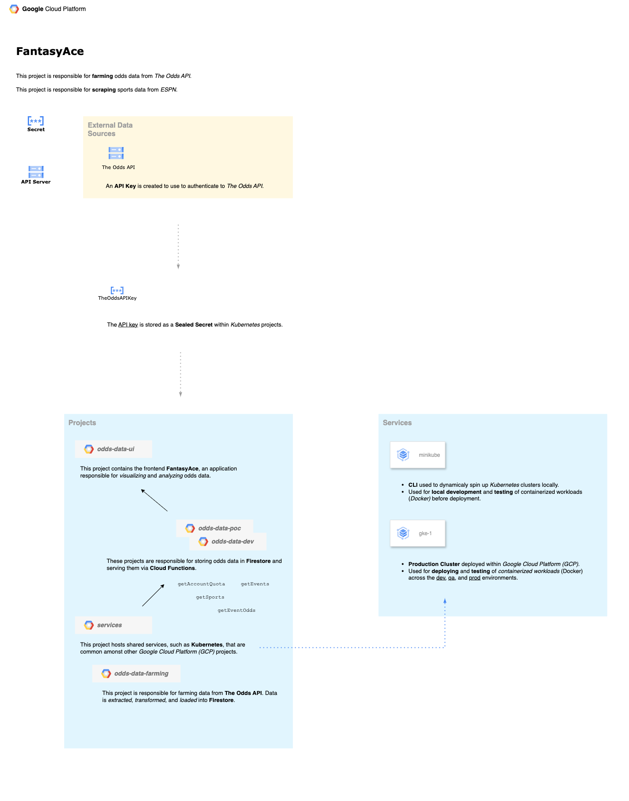

# Odds Data Farming

This project is responsible for **farming** data from _The Odds API_ and _Sports Game Odds_.



## Scripts

The scripts are organized across a series of directories.

| Directory     | Description                                                                          |
| -----------   | --------------------------------------------------------------------------------------- |
| **api**       | Scripts responsible for **querying** data from _Sports Game Odds_ and _The Odds API_.   |
| **bin**       | Scripts responsible for aspects of the **ETL** process.                                |
| **build**     | Scripts responsible for aspects of the **CICD** process.                                |
| **extract**   | Scripts responsible for **extracting** data from _Sports Game Odds_ and _The Odds API_. |
| **transform** | Scripts responsible for **transforming** data from _Sports Game Odds_ and _The Odds API_. |
| **load**      | Scripts responsible for **loading** data from _Sports Game Odds_ and _The Odds API_. |

## Testing

**Jasmine** is utilized to unit test the scripts due to support for *ECMAScript (ES Modules)* modules out of the box.

```sh
# Execute Unit Tests
npm test
```
